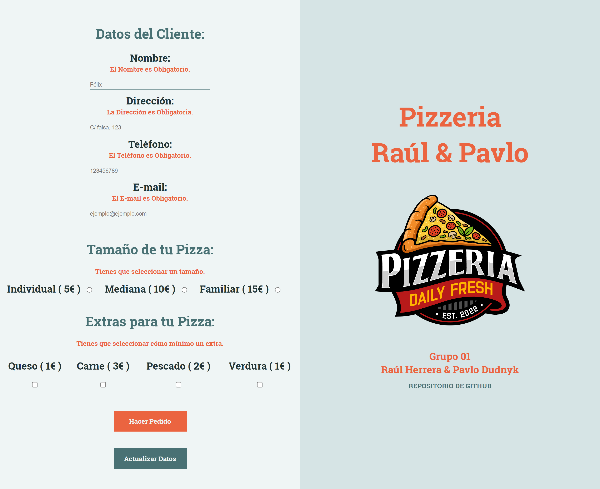
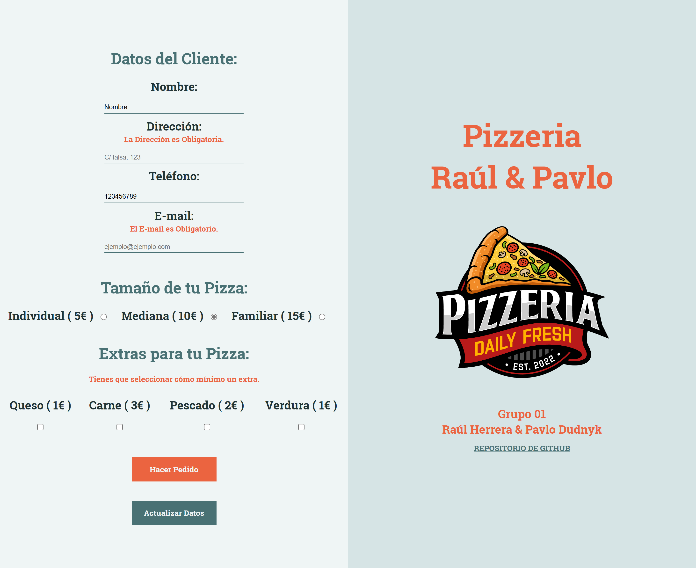
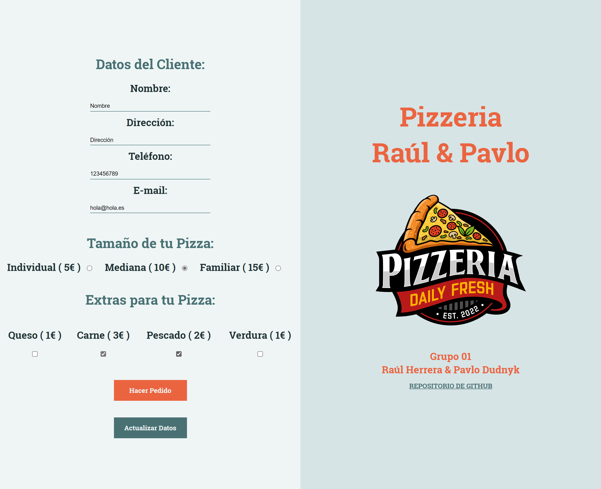
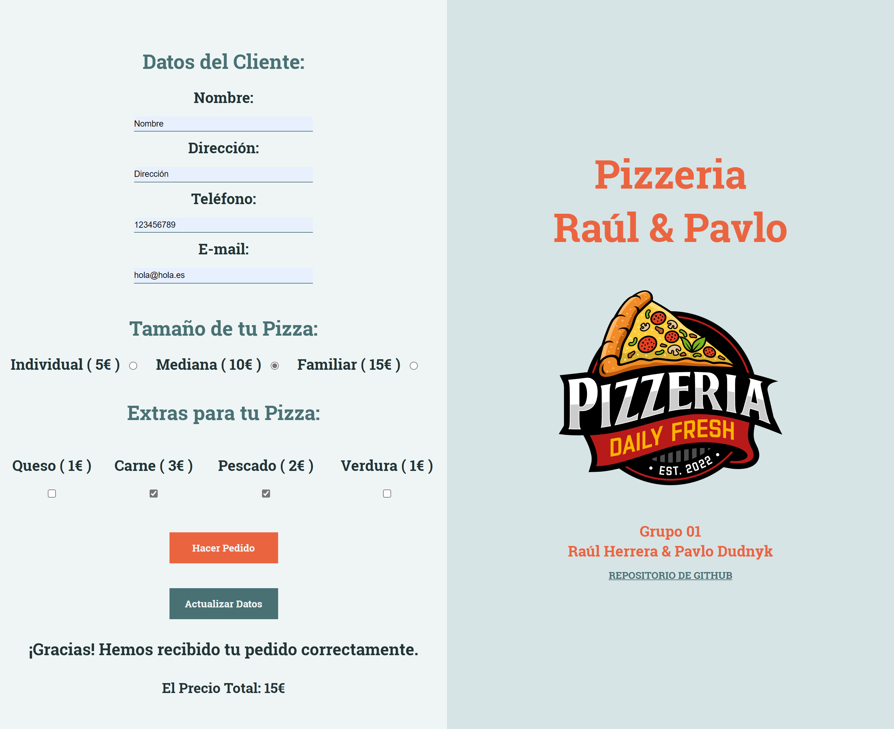
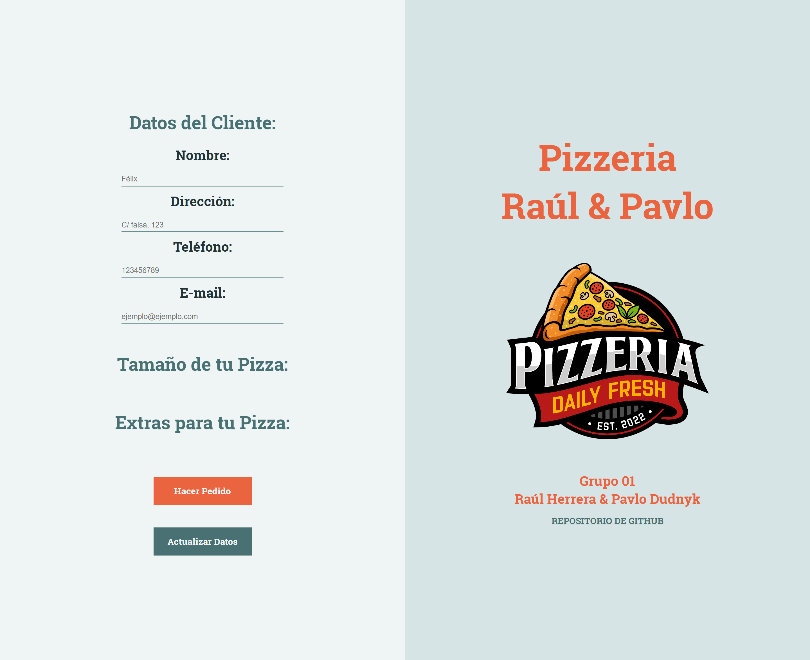
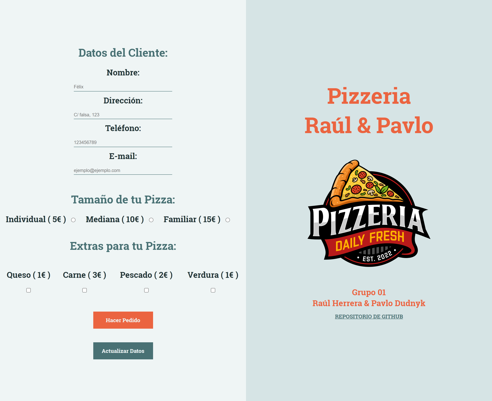

# AE-2. AJAX 
## Grupo 01  (Pavlo Dudnyk y Raúl Herrera).

### Índice:
---
* Distribución del Trabajo en Equipo.
* Estructura del proyecto.
* Capturas prueba de funcionamiento.

---
>## Distribución del Trabajo en Equipo.

El trabajo ha sido realizado de manera colaborativa, realizando una primera reunión para la planificación de trabajo, donde se decidió que ambos realizaramos el trabajo por separado con el fin de poder aprender mejor los conceptos aprendidos en clase. Durante el desarrolo de la actividad hemos mantenido reuniones para aclarar dudas que nos han ido surgiendo según se avanzava en la actividad. 

Una vez finalizado los trabajos por separado, hemos mantenido una reunión final donde se ha decidido qué contenido presentar, el cual se encuentra en la carpeta AE2_AJAX.

Adicionalmente, Pavlo se ha encargado de la parte de diseño debido a su buen gusto y creatividad, y Raúl se ha encargado de realizar el documento readme.md en lugar de un documento .PDF

---
>## Estructura del proyecto.

* **Carpeta data:** Contiene los ficheros .json
    * **pizzeriaData.json:** Contiene los datos de los Tamaños y Extras para la Pizza.
* **Carpeta img:** Contiene las imágenes necesarias para el proyecto.
    * **Carpeta capturasParaReadme:** Contiene las capturas necesarias para poder usarlas en el fichero readme.md.
    * **logoPizzeria.ai:** Fichero utilizado para crear el logo original en Adobe Ilustrator.
    * **logoPizzeria.png:** Logo en formato png para ver al pulsar en el cógido desde un IDE como visual.
    * **logoPizzeria.svg:** Es el archivo que se ha usado para mostrar el logo en la página de inicio.
* **Carpeta js:** Contiene los fichero .js necesarios.
    * **form.js:** Contiene toda la lógica del proyecto.
    Por un lado se realiza la comprobación de campos vacios con sus correspondientes mensajes que le sirven al usuario para saber cuales son los campos que ha dejado vacios y son necesarios rellenar. 
    Por otro lado, verifica las opciones seleccionadas en Tamaño de Pizza e Ingredientes y calcula el precio, mostrando un mensaje y con el cálculo del importe total según la elección del cliente al pulsar el botón Hacer pedido.  
    * **main.js:** Contiene los datos de conexión y las funciones para traer la información del server cuando se termina de cargar la página. También contiene las funciones para crear y pintar los elementos de Datos del cliente, Tamaños de la pizza, e ingredientes a través del DOM, así como el evento al hacer click en el botón de Actualizar Datos.
* **index.html:** Es la página de inicio y única del proyecto. 
* **style.css:** Es el fichero que se usa para dar el estilo a la página.
---

>## Capturas prueba de funcionamiento.  
## 1. Página de inicio.  

A continuación, se muestra captura de la página de inicio (index.html). 

## 2. Hacer pedido con todos los campos vacios.
En la siguiente captura, se puede observar que al dejar todos los campos de Datos de Cliente vacios y no se han seleccionado ninguna de las opciones de Tamaño de Pizza ni de Extras para la Pizza y trás pulsar el botón de Hacer pedido, se muestran en rojo los avisos correspondientes de cada campo y opciones.

Si el usuario edita el formulario y añade los datos pero se deja alguno sin poner, se eliminaran los errores en los campos rellenos, pero seguiran apareciendo en los campos que siguen con error:

## Todos los campos rellenos antes de Hacer Pedido.

En la siguiente captura se puede apreciar el formulario con todos los campos rellenos y opciones seleccionadas antes de pulsar el botón Hacer pedido:

## 3. Hacer Pedido con todos los campos rellenos.

A continuación de la captura anterior, se muestra la siguiente captura donde se puede apreciar que trás pulsar el botón Hacer pedido aparece un texto que dice "¡Gracias! Hemos recibido tu pedido correctamente", y debajo el precio con el cálculo total según el Tamaño e ingredientes seleccionados:

## 4. Actualizar Datos despues de hacer pedido.

Por último, se muestra captura despues de pulsar en "Actualizar Datos".
Cómo vemos lo primero que sucede (parando la ejecución), esque se vacian los tamaños e Ingredientes.

Para que seguidamente vuelva a hacer una llamada al servidor y vuelva a traer los nuevos tamaños e ingedientes.

---
>## Grupo compuesto por:

* [Raúl Herrera](https://www.linkedin.com/in/raúl-herrera-gil/)
* [Pavlo Dudnyk](https://www.linkedin.com/in/pavlo-dudnyk/)

---

>## Iniciativa del **proyecto**.

#### Trabajo realizado por **Grupo 01** para el proyecto **AE-2. AJAX**  de la asignatura ***Desarrollo de aplicaciones web entorno cliente*** para el profesor **Félix de Pablo**.